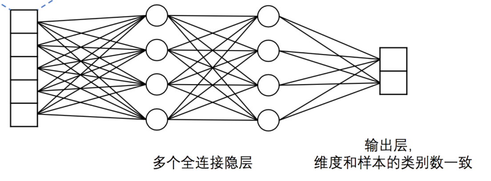

# DNN模型
## 模型结构
**DNN 模型结构入下图所示：**
<p align="center">
 <br/>
Figure 1. DNN 模型结构
</p>

模型主要分为如下几个部分：

- **输入层**：输入连续值特征，特征维度由-f指定。

- **全连接隐层**：输入向量被送入N个连续的隐层，隐层之间为全连接结构。

- **输出层**：输出层的神经元数量和样本的类别数一致，例如在二分类问题中，输出层会有2个神经元。通过Softmax激活函数，输出结果是一个归一化的概率分布，和为1，因此第$i$个神经元的输出就可以认为是样本属于第$i$类的预测概率。

# 模型训练

1. 数据组织

假设有如下格式的训练数据：每一行为一条样本，以 ` ` 分隔，前十列是输入10维特征，最后一列是类别标签。以下是两条示例数据：
```
0.1633836 -0.3711518 -0.0259373 0.1322735 0.0876563 0.2604049 0.0125503 0.2634946 0.1022274 0.6153814 1
-0.257876 0.492843 0.0172795 -0.6734815 -0.0109225 0.115816 -0.781423 0.6629765 0.062654 -0.107251 0
```
2. 训练参数

执行 `python train.py --help` 可以获取`train.py` 脚本各项启动参数的详细说明，主要参数如下：
```
usage: train.py [-h] [-d DATA_PATH] [-b BATCH_SIZE] [-p NUM_PASSES] -y
                MODEL_TYPE -f FEATURE_DIM [--dnn_dims DNN_DIMS] [-c CLASS_NUM]
                [--num_workers NUM_WORKERS] [--use_gpu USE_GPU]

PaddlePaddle DNN model

optional arguments:
  -h, --help            show this help message and exit
  -d DATA_PATH, --data_path DATA_PATH
                        path of training dataset
  -b BATCH_SIZE, --batch_size BATCH_SIZE
                        size of mini-batch (default:100)
  -p NUM_PASSES, --num_passes NUM_PASSES
                        number of passes to run(default:50)
  -y MODEL_TYPE, --model_type MODEL_TYPE
                        model type, 0 for classification, 2 for regression
                        (default: classification)
  -f FEATURE_DIM, --feature_dim FEATURE_DIM
                        dimention of feature, default is 800
  --dnn_dims DNN_DIMS   dimentions of dnn layers, default is '256,128,64,32',
                        which means create a 4-layer dnn, demention of each
                        layer is 256, 128, 64 and 32
  -c CLASS_NUM, --class_num CLASS_NUM
                        number of categories for classification task.
  --num_workers NUM_WORKERS
                        num worker threads, default 1
  --use_gpu USE_GPU     whether to use GPU devices (default: False)
```
  - `data_path` ： 数据集的路径
  - `num_passes`: 模型训练多少轮
  - `model_type`: 模型分类或回归
  - `feature_dim`: 输入特征的维度
  - `dnn_dims`: 模型各层的维度设置，默认为 256,128,64,32，即模型有4层，各层维度如上设置
  - `batch_size`：指定多少条样本后进行一次神经网络的前向运行及反向更新。
  - `class_num`：分类数，当model_type为分类时必须指定。
  
  
